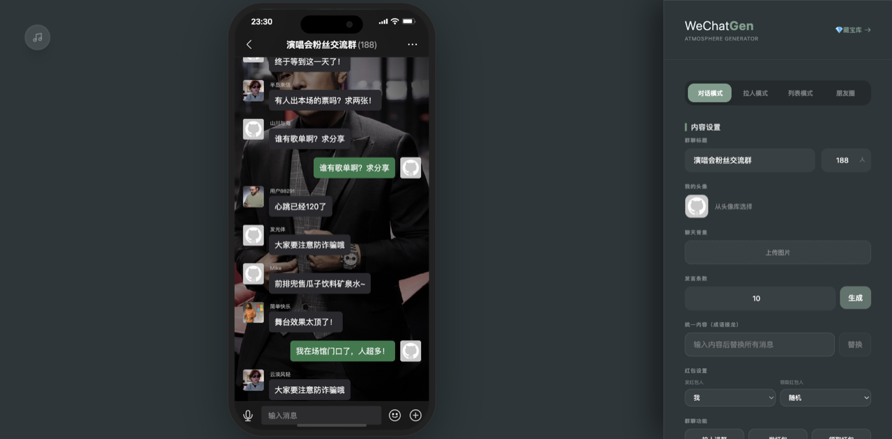
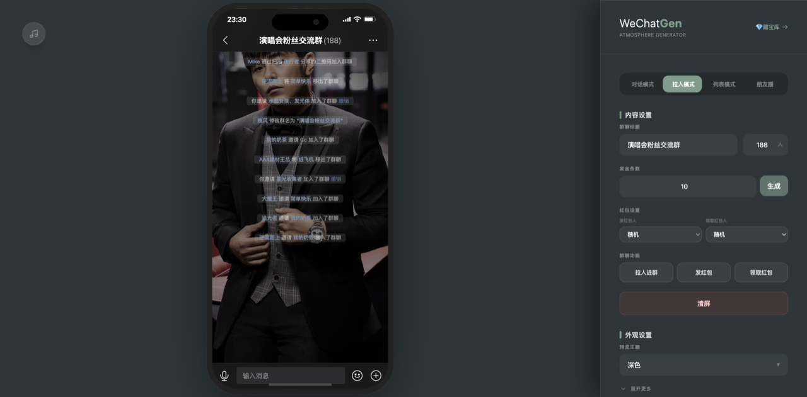
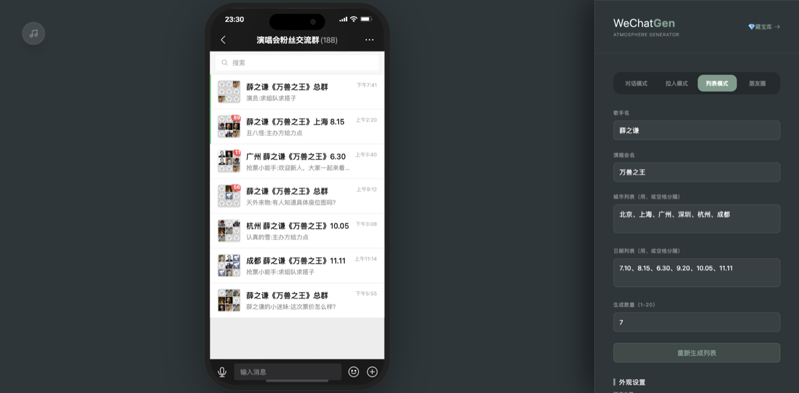
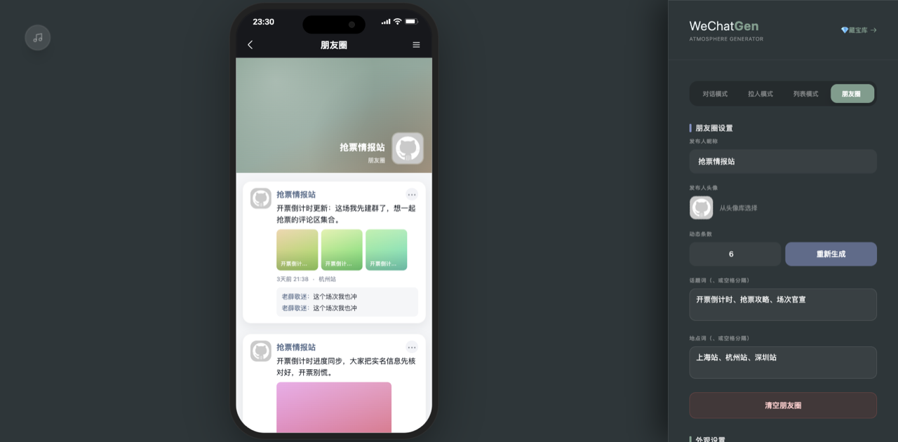
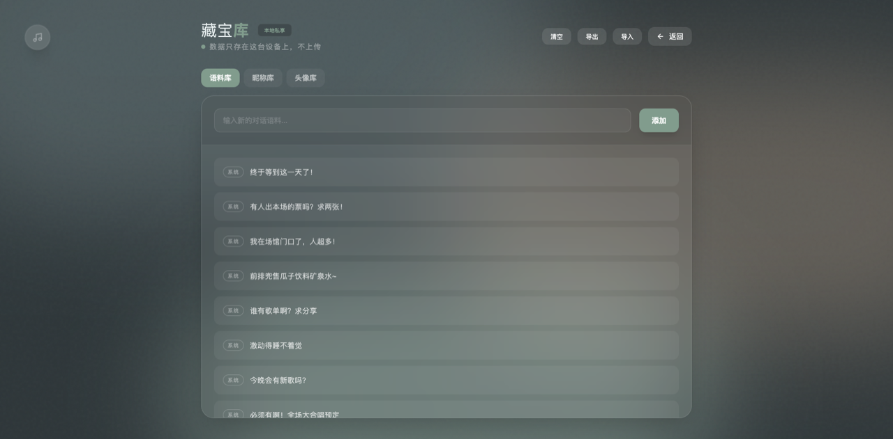

# WeChat Chat Gen

A front-end app for generating high-quality WeChat chat-style mockup images. Supports four modes — chat / invite / list / Moments — plus corpus management and batch screenshot export.

**Live demo → [wechat.webkubor.online](https://wechat.webkubor.online)** (no signup, open and use)

[中文](./README.md)

## UI

Four modes share the same left-side phone preview + right-side config panel. Changes reflect instantly. The "Treasure Vault" (top-right) manages corpus, nicknames, and avatars.

| Chat mode | Invite mode |
|---|---|
|  |  |
| Group bubbles, red packets, custom backgrounds and avatars | Invite-to-group system flow, names auto-tinted in WeChat blue |

| List mode | Moments |
|---|---|
|  |  |
| Batch-generate conversation lists, with unread red dots and 3×3 group avatars | Dynamic images, hashtags, locations, and comments |



> Treasure Vault: corpus / nickname / avatar — **data lives only in the local browser's IndexedDB, never uploaded**.

## Features

- One-click switch between chat / invite / list / Moments modes
- Customize group title, member count, nickname styling, and system-message styling
- Swap chat background and "me" avatar
- Corpus management (add, delete, clear, import, export)
- One-click batch generate and export high-resolution PNGs

## Tech stack

- Vue 3 + TypeScript + Vite
- Pinia
- Tailwind CSS
- html2canvas (screenshot export)

## Local development

```bash
pnpm install
pnpm dev
```

Build:

```bash
pnpm build
pnpm preview
```

## Deployment

Hosted on Cloudflare Pages (project `wechat-chat-gen`), domain `wechat.webkubor.online`, via CF orange cloud proxy. **No auto-deploy from git** — pushing code does not go live. To publish:

```bash
CLOUDFLARE_ACCOUNT_ID=916ebb1b9f240bf4c8826021dd161692 pnpm deploy
```

Account is the `Webkubor@gmail.com` one (`wrangler whoami` shows two; without explicit selection it stalls at the interactive prompt).

After publishing, verify the live version — read the commit from `version.json`. Don't infer from asset filename hashes (hashes vary by build environment; the code may be the same):

```bash
curl -s https://wechat.webkubor.online/version.json
```

The site ships a PWA Service Worker; returning visitors need to refresh or wait for the SW update before seeing the new version. Hard-refresh when verifying yourself.
`public/_redirects` is the SPA deep-link fallback (vue-router uses history mode) — don't delete it.

## Usage

1. Adjust group and styling config in the right panel.
2. Pick the target mode, adjust its config, click "Refresh preview only".
3. Click "Batch download all results" to export multiple images.
4. Corpus entry is at top-right "Corpus".

## Corpus placeholders

Invite mode supports the following placeholders:

- `{name}` inviter
- `{invited}` invitee
- `{other}` other members

## Directory structure

```
src/
  components/        # components (chat view, config panel, device frame, etc.)
  stores/            # Pinia state management (chat + corpus)
  views/             # pages (generator, corpus)
  assets/            # static assets
```

## Data & privacy

- Corpus data is stored in the browser's IndexedDB — local only.
- Preview avatars use public image URLs as sample assets (replace as needed).
- Cloud sync is preserved but disabled by default; set `VITE_CLOUD_SYNC_ENABLED=true` to enable.