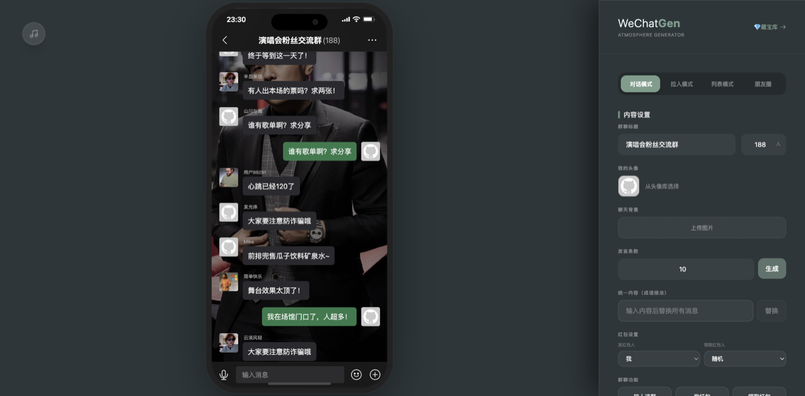
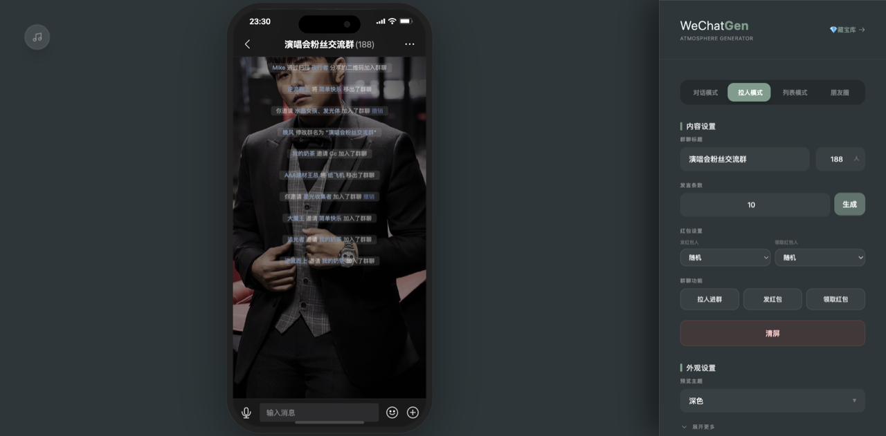
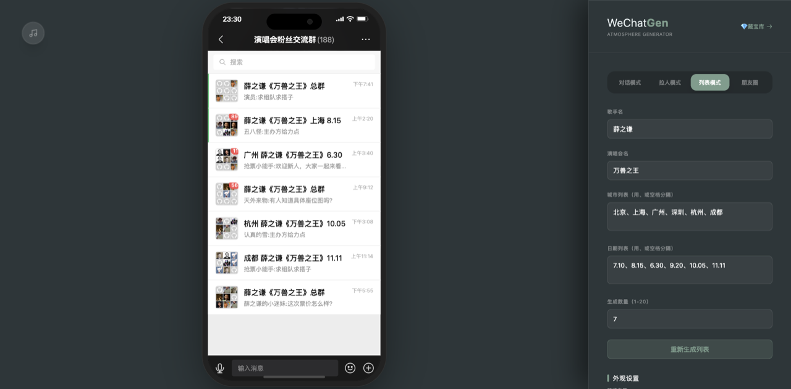
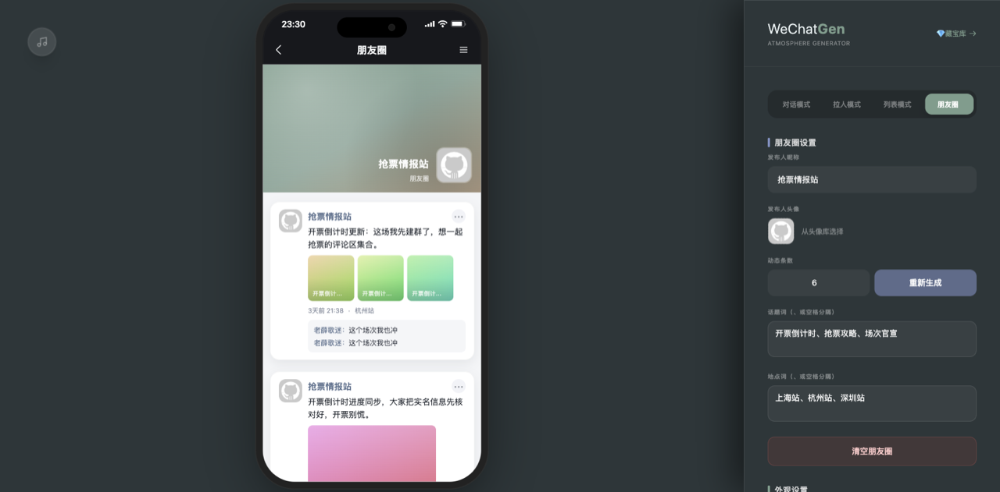
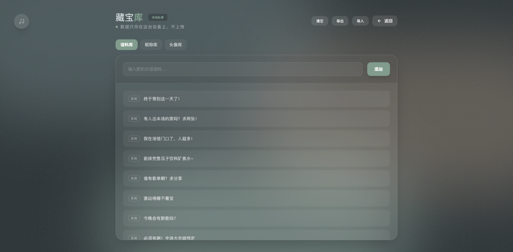

# WeChat Chat Gen

一个用于生成高质感微信聊天氛围图的前端应用，支持对话、拉人、列表、朋友圈四种模式，支持语料库管理与批量导出截图。

**在线体验 → [wechat.webkubor.online](https://wechat.webkubor.online)**（无需注册，打开即用）

## 界面

四种模式共用左侧手机预览 + 右侧配置面板，改完即时出图，右上角「藏宝库」管语料、昵称与头像。

| 对话模式 | 拉人模式 |
|---|---|
|  |  |
| 群聊气泡、红包、自定义背景与头像 | 邀请入群的系统提示流，人名自动染微信蓝 |

| 列表模式 | 朋友圈 |
|---|---|
|  |  |
| 批量生成会话列表，含未读红点与九宫格群头像 | 动态配图、话题词、地点与评论 |



> 藏宝库：语料 / 昵称 / 头像三个库，**数据只存在本机浏览器 IndexedDB，不上传**。

## 功能亮点

- 对话 / 拉人 / 列表 / 朋友圈四模式一键切换
- 自定义群聊标题、成员数、昵称样式与系统提示样式
- 支持更换聊天背景与“我”的头像
- 语料库管理（新增、删除、清空、导入、导出）
- 一键批量生成并导出高清 PNG

## 技术栈

- Vue 3 + TypeScript + Vite
- Pinia
- Tailwind CSS
- html2canvas（截图导出）

## 本地开发

```bash
pnpm install
pnpm dev
```

如需打包：

```bash
pnpm build
pnpm preview
```

## 部署

托管在 Cloudflare Pages（项目 `wechat-chat-gen`），域名 `wechat.webkubor.online`
走 CF 橙云代理。**没有 Git 自动部署**，推代码不会上线，发布用：

```bash
CLOUDFLARE_ACCOUNT_ID=916ebb1b9f240bf4c8826021dd161692 pnpm deploy
```

账号是 `Webkubor@gmail.com` 那个（`wrangler whoami` 下有两个，不显式指定会卡在选择交互）。

发布后核对线上版本 —— 读 `version.json` 的 commit，不要靠 assets 文件名的 hash 推断
（不同构建环境 hash 会变，代码可能是同一份）：

```bash
curl -s https://wechat.webkubor.online/version.json
```

站点带 PWA Service Worker，老访客要刷新或等 SW 更新才看到新版；自己验的时候先硬刷新。
`public/_redirects` 是 SPA 深链回退（`vue-router` 用 history 模式），别删。

## 使用说明

1. 在右侧面板调整群聊与样式配置。
2. 选择目标模式后调整配置，点击“仅刷新预览”。
3. 点击“一键批量下载成品图”进行多张导出。
4. 语料库入口在右上角“语料库”。

## 语料占位符

拉人模式支持以下占位符：

- `{name}` 邀请人
- `{invited}` 被邀请人
- `{other}` 其他成员

## 目录结构

```
src/
  components/        # 组件（聊天视图、配置面板、设备框等）
  stores/            # Pinia 状态管理（聊天与语料）
  views/             # 页面（生成器、语料库）
  assets/            # 静态资源
```

## 数据与隐私

- 语料库数据保存在浏览器 IndexedDB 中，仅存本地。
- 预览头像会使用公开图片链接作为示例素材（可自行替换）。
- 云端同步功能保留但默认关闭，如需启用请在环境变量中设置 `VITE_CLOUD_SYNC_ENABLED=true`。
